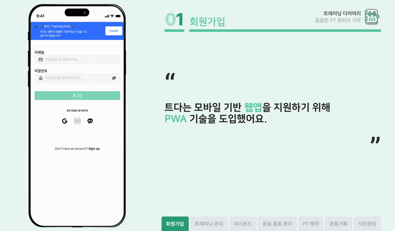
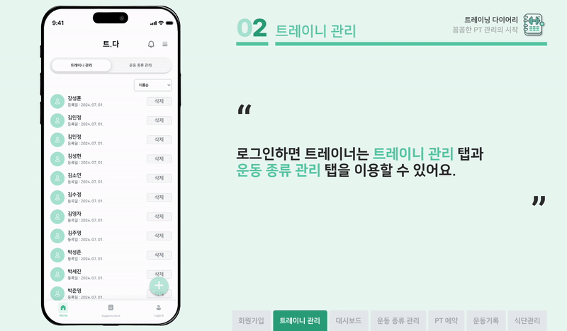
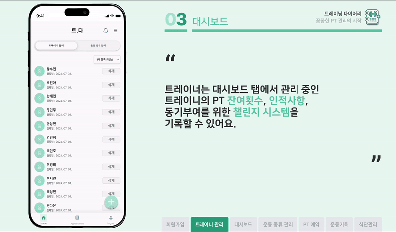
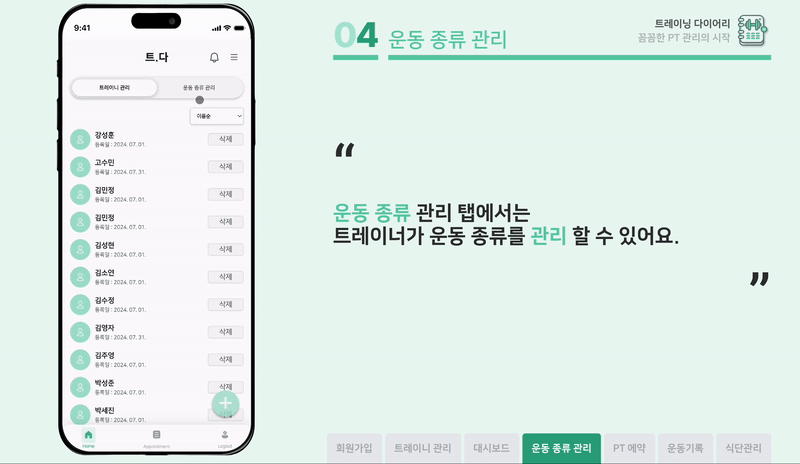
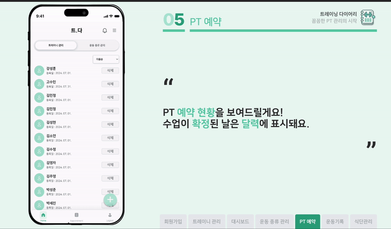
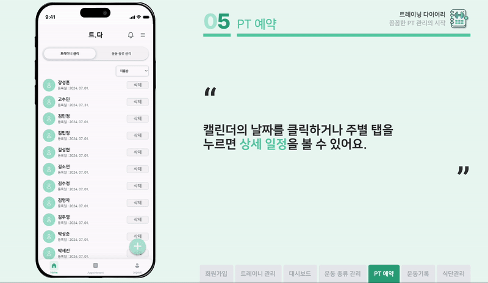
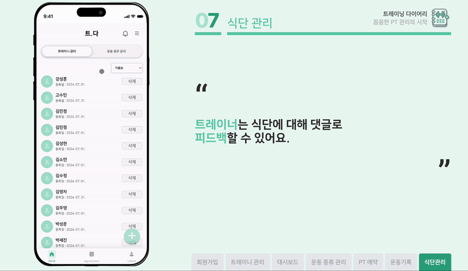

# 트레이닝 다이어리

트레이너의 효율적인 트레이니 관리 플랫폼 - **Training Diary**

### PT 예약, 트레이닝 세션과 식단 관리를 한 곳에서 해결하세요!

- 🗓️  여러 회원과의 일정을 관리해주는 PT 예약

- 📝  트레이니 혼자서도 할 수 있도록 운동 기록 작성

- 📈  트레이니의 신체 변화를 추적할 수 있는 대시보드

- 🍽️  꾸준한 식단 관리 피드백을 받을 수 있는 공간

## 프로젝트 배경

- 개인 맞춤형 헬스 관리 서비스 시장 성장

    - 2020년 기준 약 60억 달러 규모, 연평균 15% 이상의 성장률 예상 (Mordor Intelligence, 2021)

    - 사용자 건강 데이터를 활용한 맞춤형 솔루션 제공 필요

- PT 수강 경험

    - 높은 PT 가격과 강의 종료 후 혼자 운동 시 어려움

    - 트레이너의 지도를 잊고 운동

    - 트레이너와의 체계적 관리 희망

    - 트레이너와 회원 간의 소통 및 스케줄 조정

    - 회원별 노트 관리

## 기대효과

- 실시간 소통 및 체계적 관리

- 회원의 운동 습관 개선

- 트레이너의 업무 효율성 및 회원 관리 편의성 향상

- 헬스 PT 시장 활성화

- 개인 전화번호 및 카카오톡 공유 없이 소통 가능

## 사용해보기

- https://training-diary.co.kr

    - 운영예정일: 2024.8.1. ~ 2025.7.31.

    - 이메일로 회원가입 후 사용할 수 있습니다.

    - 동영상 업로드 기능은 운영비용 문제로 현재는 사용할 수 없습니다.

## 시연영상

- [시연 영상 보러가기](https://www.notion.so/marcel-manual/Training-Diary-9a4729c1df6c4150a189540024803657?pvs=4#928d5ed35f05450aaf050dde4443f318)

## 주요기능

- 회원가입 및 로그인

    

- 트레이니 관리

    

- 트레이니 대시보드

    

- 트레이니에게 제공할 운동 종류

    

- PT 예약

    

    

- 그날의 운동 기록

    

- 트레이니 식단 공유

    

    

## 프로젝트 페이지

- 프론트엔드 - https://github.com/TrainingDiary/training-diary-frontend

- 백엔드 - https://github.com/TrainingDiary/training-diary-backend

- 노션 소개 페이지 - https://marcel-manual.notion.site/5d202ab0345b4517be827bace3ed23c2?pvs=4
